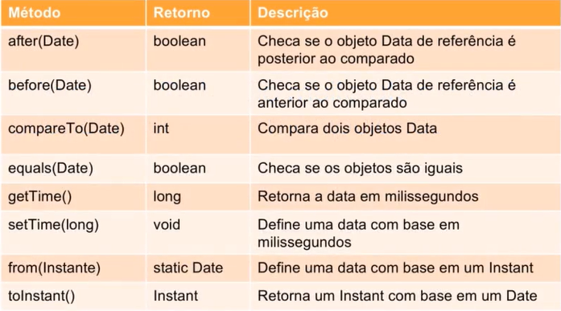

# **Desenvolvimento básico em java**

# **_Preparando o ambienete para programação em java_**

## **java - Instalação e Ambiente**
- IntelliJ IDEA: https://www.jetbrains.com/pt-br/idea/
- Gradle: https://gradle.org/install/
- Maven: https://maven.apache.org/download.cgi


## **Java - Criação de Projetos**

O Spring Boot é um projeto da Spring que veio para facilitar o processo de configuração e publicação de nossas aplicações. A intenção é ter o seu projeto rodando o mais rápido possível e sem complicação.

Ele consegue isso favorecendo a convenção sobre a configuração. Basta que você diga pra ele quais módulos deseja utilizar (WEB, Template, Persistência, Segurança, etc.) que ele vai reconhecer e configurar.

Você escolhe os módulos que deseja através dos starters que inclui no pom.xml do seu projeto. Eles, basicamente, são dependências que agrupam outras dependências. Inclusive, como temos esse grupo de dependências representadas pelo starter, nosso pom.xml acaba por ficar mais organizado.

Apesar do Spring Boot, através da convenção, já deixar tudo configurado, nada impede que você crie as suas customizações caso sejam necessárias.

O maior benefício do Spring Boot é que ele nos deixa mais livres para pensarmos nas regras de negócio da nossa aplicação.

Springboot online: https://start.spring.io/
>> Obs: Dependência escolhida, WEB.

- Arquivo pom.xml
  - É o principal arquivo de configuração de uma aplicação com recursos Maven.
  - Nele temos todas os parâmentros de configuração do projeto, propriedades e dependências.

- Importando o projeto para o IntelliJ MAVEM
  - Após gerar o springboot apartir do site, basta descompacatar a pasta e abrir o arquivo pom.xml. 
>> Nesse momenato a IDEA, realiza a instalação e download das dependências.
  - Parar iniciar o proçjeto, ao lado direoto superior da IDEA pasta acessar: Maven>name-pojeto>Lifecycle>install
>> Vai gerar um jar com as classes compiladas e documentações
  - Rodar o projeto via springboot: mavem>plugins>springboot>spring-boot:run
>> Mostra em qual porta hoslt o projeto está.

-importar o projeto gradle 
  - Abrir o arquivo gradle. build
  - Mesma coisa para rodar: Tkas>build>build e rodar tasks>application>bootRun


  

# **_O que precisamos saber sobre java_**

## **Oque precisamos saber sobre java**

### **O que é java?**

Java é uma linguagem criada em 1995 pela sun microsystem, por um time comandado por `James Gosling`. Anos depois foi adquirida pela Oracle.

Diferentes de outras linguagens de programação, que não são compiladas para `código nativo`, o java é compilada para um `bytecode` que é interpretado por uma `máquina virtual`.

### **O que é o compilador?**
Um compilador é um programa que, a partir de um código fonte, cria um programa semanticamente equivalente, porém escrito em outra linguagem textual para uma linguagem de máquina,específica para um processador e sistema operacional.

O nome compilador é usado principalmente para os programas que traduzem o código fonte de uma linguagem de programação de alto nível para uma linguagem de programação de baixo nível (por exemplo, assembly)

### **O que é uma VM?**
Uma máquina virtual ou virtual machine, é um software que simula uma máquina física e consegue executar vários programas, gerenciar processos, mémoria arquivos. Tudo isso faz parte de uma plataforma com mémoria, processador e outros recursos totalmentes virtuais, sem dependência do hardware.

### **O que é a JVM?**
A JVM é uma máquina virtual que executa programas Java, executando os bytescodes em linguagem de máquina para cada sistema opercional. 

Em linguagens compiladas diretamente para um sistema operacioal (SO) específica, esse programa não íra executar em outro SO, havendo a necessidade de compilar uma versão do software para cada SO.
 
Com o java, compilamos para a JVM, o bytecode será executado pela máquina virtual, e não diretamente pelo SO, assim o software escrito em Java possui portabilidade para qualquer sistema operacional, porém, cada JVM deve ser construída para um SO específico.


### **O que é JRE?**
JRE significa `Java Runtime Environment`, ou Ambiente de Execução do Java, é composto pela Java Virtual Machine(JVM), biliotecas e APIS da Linguagem Java e outros componesntes para suporte da plataforma Java.

### **O que é a JDK?**

Java Development Kit (JDK), kit de desenvolvimento java, é um conjunto de utilitários que permitem criar software  para a plataforma Java. É composto pelo complafor Java, bibliotecas da linguagem, ferramentas e JRE. 

### **O que pe Java SE**

Java Standard Edition (SE), é a distribuição mínima da plataforma de desenvolvimento de aplicação Java. 
O penJDK é a implementação de referência opensource da Plataforma Java, Java SE, que ainda é mantida pela Oracle.

### **O que é java EE**

Java Enterprise Edition, é ma extensão da Java SE que possui suporte a desenvolvimeto de sistemas corporativos. Além do mínimo da plataforma, o Java EE possui diversas especificações de partes da infra estrutura de aplicações, como acesso a banco de dados, mensagens, serviços web, parser de arqivos e outras. Servidores de aplicações JavaEE, sabem seguir essas especificações e implementar os recursos para os usuários.
EX: Jboss(RedHat),Wweblogic (Oracle), WebShere (IBM) e Glassfish.

### **O que pe Jakarta EE?**
Com a falta de investimentos da Oracle no Java, ela cedeu tod o código, implementações e especificações do Java EE para a Eclipse Foundation, mas como o nome Java EE é uma marca registrada, foi escolhido o nome Jakarta EE. Agora a evolução  da especificação e padrões do java será feito sob o nome Jakarta EE, com compatibilidade com o Java EE.


**__Compilando código java__**: javac <nome classe>.java (sem argumetos), javac <nome classe>.java argc argv Ex.: javac main.java 1 2
**__Rodando executável__** java: java <nome classe>


# **_Características da linguagem I_**

## **Iniciando um Projeto Java**

Classes

- Main

O método main é um método associado à classe e não a um objeto específico da classe -- assim, ele é definido como um método estático. Adicionalmente, deve ser um método público para permitir sua execução a partir da máquina virtual Java.

- Atributos

Os Atributos em Programação Orientada a Objetos são os elementos que definem a estrutura de uma classe. Os atributos também são conhecidos como variáveis de classe, e podem ser divididos em dois tipos básicos: atributos de instância e de classe.

Os valores dos atributos de instância determinam o estado de cada objeto. Um atributo de classe possui um estado que é compartilhado por todos os objetos de uma classe. Atributos de classe podem ser chamados também de atributos estáticos. Constantes são considerados atributos de classe quando estão fora de qualquer método.

As mensagens enviadas a um objeto (chamada de um método) podem mudar o valor de um ou mais atributos, alterando o estado de um objeto.

Um atributo é um dado para o qual cada objecto tem seu próprio valor. Atributos são, basicamente, a estrutura de dados que vai representar a classe. Exemplo de atributos, usando a classe fila: int f [100] ; int primeiro, ultimo;

- Métodos

Um método em Java é equivalente a uma função, subrotina ou procedimento em outras linguagens de programação. Não existe em Java o conceito de métodos globais. Todos os métodos devem sempre ser definidos dentro de uma classe.

- Retornos

métodos com retono, estamos dizendo que o método que se encontra em outra classe ira executar uma determinada informação, essa informação é o resultado de um conjunto de intruções do método

- Parametros

Parâmetros são valores que passamos para um método, estes valores são recebidos pelas variáveis criadas dentro do parênteses do método.

- Assinatura
  
A assinatura do método é formada pelo seu nome e pelo tipo, quantidade e ordem de seus parâmetros. Desta forma, é possível existirem na mesma classe, métodos com o mesmo nome, desde que tenham listas de parâmetros diferentes.

- Construtores

Construtor é definido como um método cujo nome deve ser o mesmo nome da classe e sem indicação do tipo de retorno -- nem mesmo void. O construtor é unicamente invocado no momento da criação do objeto através do operador new. O retorno do operador new é uma referência para o objeto recém-criado.

**Exemplo:**

```java
public class Endereco{
    //atributos de instancia, cada instancia(objeto) da classe Caixa conterá estes "valores" independentes de outra instancia(objeto)
    //atributos de classe, isto é TODAS as instancias dessa classe
    //compatilharão estes atributos
    private String rua, cep,bairro,numero,cidade;
    //Por default em java todas as variaveis staticas recebem o valor de 0 para valores numericos, false para booleanos e null para referencias
    public Endereco(String rua, String cep, String bairro, String numero, String cidade){
        this.rua = rua;
        this.cep = cep;
        this.bairro = bairro;
        this.numero = numero;
        this.cidade = cidade;
    }

    public void setRua(String rua){
        this.rua = rua;
    }
    public String getRua(){
        return rua;
    }

    public void setCep(String cep){
        this.cep = cep;
    }
    public String getCep(){
        return cep;
    }

    public void setBairro(String bairro){
        this.bairro = bairro;
    }
    public String getBairro(){
        return bairro;
    }

    public void setNumero(String numero){
        this.numero = numero;
    }
    public String getNumero(){
        return numero;
    }

    public void setCidade(String cidade){
        this.cidade = cidade;
    }
    public String getCidade(){
        return cidade;
    }
}
```


## **Tipos primitivos, wrapper, não primitivos e tipagem forte e estática**

- Primitivos
- Wrappers
- Não primitivos
- Tipagem forte e estática

### **Primitivos**
* Não aceitam null
* Possuem valores default


>> Valores Default

```java
public class Primitivos {
    public static void main(String[] args) {
        //Inteiros

        //byte nullByte = null
        byte b; //8 bits
        byte b1 = 127;
        byte b2= -128;
        //byte b3 = 129 //to large

        char c; //16 bits
        char c1 = 'A';
        char c2 = 13;
        //char c3 = 'AA'; //NOK
        //char c4 = -100; //NOK

        short s; //16 bits
        short s1 = 32767;
        short s2 = -32768;

        int i = 2147483647; //32 bits
        int i2 =-2147483648;

        long l = 922372036854775807L; //64 bits
        long l2 = -922372036854775808L;

        //Flutuantes

        float f = 65f; //32 bits
        float f2 = 65.0f;
        float f3 = 0.5f; // 1.4 e-45

        double d = 1024.99; // 64 bits

        //Boleano
        boolean bo = true;
        boolean bo2 = false;

        //void v; //void não é um tipo
    }
}
```

>> Valores Default dos tipos primitivos

```java
public class DefaultValue {
    public static void main(String[] args) {
        final Default d = new Default();
        System.out.println("Valores default: " + d.getI());
        System.out.println("Valores default: " + d.isActive());
    }
}

class Default{
    int i;
    boolean active;

    public int getI(){return i;}
    public boolean isActive(){return active;}
}

```
### **Wrappers**

- São objetos que representam os tipos primitivos 
- Auto-boxing e Unboxing
 
```java
public class Wrappers {
    public static void main(String[] args) {
        //Autoboxing

        Byte nullByte = null;
        Byte b; //8 bits
        Byte b1 = 127;
        Byte b2= -128;
        //Obs: se o tipo primçitaivo tiver que aceitar null
        //deve ser utilizado os Wrappers

        Character c= 'A';

        Short s = 32767;

        Integer i = 212122;

        Long l = 2112342343L;

        Float f = 56.0f;

        Double d = 10124.99;

        Boolean bo = true;

        //Seguem todos os limites de bits e
        //apresentam métodos
    }
}
```

```java
public class Unboxing {
    public static void main(String[] args) {
        //int i = new Integer(3); depreciado
        int inteiro = Integer.valueOf(1024);

        //Boolean b = new Boolean(true);

        boolean b2 = Boolean.TRUE;
        boolean b3 = Boolean.getBoolean("false");
    }
}
```

#### **Autoboxing**

Autoboxing é aplicada pelo compilador do Java nas seguintes condições:

- Quando um valor primitivo é passado como um parâmetro para um método que espera um objeto da classe Wrapper correspondente.

- Quando um valor primitivo é atribuído a uma variável da classe Wrapper correspondente.
````java
Integer integer = 9;
````

#### **Unboxing**

Unboxing é aplicada pelo compilador do Java nas seguintes condições:

- Quando um objeto é passado como um parâmetro para um método que espera um valor primitivo correspondente.

- Quando um objeto é atribuído a uma variável do tipo primitivo correspondente.

```java
int inteiro = Integer.valueOf(1024);
```
### **Não primitivos**

- String
- Number
- Object
- Qualquer outros objetos

```java
public class Naoprimitivos {
    public static void main(String[] args) {
        //Tudo é objetos em java exceto os tipos primitivos
        String texto = "Meu texto para teste"; //Sequência de caracteres

        Void v; //Tipo válido

        Object o = new Object();

        Number numero = Integer.valueOf(100);
        numero.toString();

    }
}
```

### **Tipagem forte e estática**

* Forte e estátiva
* var-inferência de tipo

#### **Tipagem estática**

Tipagem estática significa que os tipos das variáveis de um programa são explicitamente definidos no código e, portanto, conhecidos/checados em tempo de compilação.

```java
public class TipagemEstatica {
    public static void main(String[] args) {
        //Integer numero = "123213"; //Error
        //tipagem estática, os tipos das variáveis
        //são verificados em tempo de compilação
    }
}
```
#### **Tipagem Forte**

Tipagem forte costuma ser a característica que não permite um mesmo dado ser tratado como se fosse de outro tipo. É muito comum linguagens estáticas terem tipagem forte. Mas existem exceções. Isto dá mais robustez ao código.

```java
public class TipagemForte {
    public static void main(String[] args) {
        String texto = "meu texto";
        //Tipagem forte, uma vez instânciado o
        //tipo da variável ela só podera receber
        // seu tipo instânciado. Não aceita valores
        // de outros tipos sem que sejam convertidas

        //texto = 100; ERROR

        Integer numero = Integer.valueOf("10024");
        System.out.println(numero);
        numero = 1231; //Ok
        System.out.println(numero);
    }
}
```

#### **Tipagem Inferido**

```java
public class TipoInferido {
    public static void main(String[] args) {
        var numero = Integer.valueOf("123454");
        var texto = "O numero e: ";
        //Criar variáveis e determinar seu tipo apartir
        // do conteúdo que estará recebendo
        System.out.println(texto + numero);
    }
}
```
## **Modificadores de acesso**

- Public
- private
- protected
- defautl

* Public
  
public pode ser acessada de qualquer lugar por qualquer entidade que possa visualizar a classe a que ela pertence

* Private
  
Os métodos e atributos da classe definidas como private não podem ser acessados ou usados por nenhuma outra classe. Esses atributos e métodos também não podem ser visualizados pelas classes herdadas.

* Protected
  
Torna membro acessível às classes do mesmo pacote ou atráves de herança, seus membros herdados não são acessíveis a outra classes fora do pacorte em que foram declaradas.

* default(padrão)
  
A classe e/ou seus membros são acessíveis somente por classes do mesmo pacote, na sua declaração não é definido nenhum tipo de modificador, sendo este identificado pelo compilador.


>> Imagem resumo sobre os modificadores de acesso


>> Imagem representado os modificadore em forma de conjuntos demostrando os de forma que um contém o outro.


- Abstract

Esse modificador não é aplicado nas variáveis, apenas em classes e métodos Uma classe abstrata não poder ser instaciada, Se houver alguama declaração de um método como abstract(abstrato), a classe também deve ser marcada como abstract.
>> classe abstract não pode ser criado um objeto, são ideias de algo, normalmente são herdadas para serem implementas. Quem herda implementa o método abrastado
>> seus métodos são decladors somente seu escopo

- static

É usado para a criação de uma variável que poderá ser acessada por todas as instâncias de objetos desta classe como uma variável comum, ou seja, a variável criada será a mesma em todas as instâncias, a modificação ocorre em todas as demais. E nas declarações de métodos ajudam no acesso direto à classe, portanto não é necessários instanciar um objeto para acessar o método.

- final

Quando é aplicado na classe, não permite estender, nos métodos impede que o mesmo seja sobrescrito (overriding) na subclasse, e nos valores de variáveis não pode ser alterado depois que já tenha sido atribuído um valor.


## **Métodos abstratos, default e herança múltipla**

### **Inerfaces**
- Métodos abstrato
    Devem ser implementado por todos.
    Novos métodos quebram as implementações.

- Métodos default
    São herdados a todos que implementam a interface, ele é implementado na propria interface;
    Novos métodos não quebram as implementações;

- Herança múltipla***

### **Enums**

- Basicamente é dicionários de dados imutável;
- Não é permitido criar novas instâncias;
- O construtor é sempre declarado como private;
- Por convenção, por serem objetos constantes e imutáveis (static final), os nomes são em MAIÚSCULOS.
- 


# **_Características da linguagem II_**
- Strings
- Laços, condições e operadores
- Convenções

## **Strings e o pacote java.lang**

É uma sequência de caracteres;
Pacote java.lang


## **Introdução a condicionais**

IF e IF Ternário
FOR 
While e DO/WHILE
Operadores
    Igualdade
    Lógicos
    Incremento
    Matemáticos 
    Relacionais

## **Laços de repetição**

For e For eatch

## **Convenções de nomes**

Nomes de Classes 
Nomes de métodos
Nomes de variáveis

CamolCase
* Pesquisar mais sobre as ferramentasd de qualidade de softwares e usar nos projetos para melhorar meus códigos.

* Apronização do  projeto e correção para projetos empresariais.
  

>> plungs para manter o projeto padronizado


 * Adicionar na builder.gradle o id do pmd e checkstyle.


 * Configurar os arquivos adicinados ainda nas mesma pasta

https://pmd.github.io/
 
https://checkstyle.sourceforge.io/

 * Agora basta fazer o build do gradle.

# **_Debug de código_**
Utilizar os mecanismos presentes na propria IDEA.

## **Debug de código**
Faz a marcação e rode como debug para seguir o desenvolvimento do código.

# **_Orientação a Objetos com java_**

## **Introdução à aula**

## **Paradigma em orientação a objetos**
A programação Orientada a Objetos impõe disciplina sobre a transferência indireta do controle.
>> Robert "Uncle Bob" Martin Livro arquitetura limpa

"... a pilha de chamadas funções ... poderia ser movida para Heap(área de memória não necessariamente ordenada - diferente da stack) possibilita que as variáveis locais declaradas por uma função existissem muito depois que a função retornasse..."
>> Robert "Uncle Bob" Martin Livro arquitetura limpa

"A diferença entre çum código procedural e UM 0.o é bem simples. Em códigos procedurais(...) escolher o melhçor algoritmo é o mais importante(...) Já em linguagens orientadas a objetos (...) pensar no projeto de classes (...) como se encaixam (...) e como serão estendidas é o que mais importa."
>> Maurício Aniche Livro Orientação a Objetos e Solid para ninjas


### **Classe**

Vamos entender uma classe como um modelo a ser seguido. Uma classe vari funcionar como uma espécie de molde que nos servirá como base para construir algo.

Por exemplo. Quando pensamoços em construir uma casa, nós fazemos uma planta baixa. Ela será o modelo que utilizaremos para construir algo concreto.

As classes funcionam de forma parecida. Vamos a um exemplo prático.

```java
public class Pessoa{
    private String nome = "Marlon";
    public String getNome(){
        return nome;
    }
}
```
### **Objeto**

Agora que entendemos que temos um modelo que podemos seguir. O que podemos fazer com esse modelo?

Bom..Nós fizemos a analogia da casa, certo? Depois de termos a planta baixa, nós começamos a construir. E o resultado do que nós construímos, vamos chamar de `objeto`.

Quando nós utilizamos a nossa classe `Pessoa` - mostra no código anterior - para criar um objeto, nós diremos que estamos *instanciando um objeto da classe Pessoa.*
E esse termo é bem simples de entender. O que acontece é que podemos criar *vários objetos* de uma mesma classe, ou seja, várias *instâncias de objetos.*

```java
public classe ExemploPessoa{
    public static void main(String[] args){
        Pessoa pessoa = new Pessoa();
        System.out.println(pessoa.getNome());
    }
}
```


### **Atributos**

Agora vamos pensar no que nos definimos como *nome*. Foi tão intuitivo nós pensamos que uma pessoa teria um nome que nem demos importância a ele.
O nome é uma característica de uma pessoa e pode ser diferente de pessoa para pessoa. O nome é um *atributo* da pessoa.

### **Métodos**

Agora vamos pensar que uma pessoa pode ter ações. Por exemplo, uma pessoa pode falar.

Pensando em um cenário mais específico, uma pessoa pode falar o seu nome.

As ações que nós definimos que uma classe pode ter, nós chamamos de *métodos*.

```java
public class ExemploMetodos{
    public static void main(String[] args){
        Pessoa pessoa = new Pessoa();
        System.out.println(pessoa.falaMeuProprioNome());
    }
}
```

## **Criando objetos com construtores**

Podemos entender o termo *construtor* no sentido literal, afinal vamos *construir um objeto*.

Por meio de um construtor, *criamos um objeto* baseado em um classe e assim  *alocamos um memória*(`new`).

Ao criamos um objeto dizemos que estamos instanciando um objeto.

```java
class Pessoa{
    ...
    //Construtor
    Pessoa(){} //Construtor padrão
    Peeosa(String nome){this.nome = nome; } //Construtor novo. Obs: sobrecargar utilizado
    ..
}
```
Exemplo que acabamos de ver é o exemplo mais comum quando começamços a estudar construtores em Java.
E para instanciar esse classe(criar um objeto dela) fazemos o seguinte:

```java
Pessoa pessoa = new Pessoa(); //Instânciando com o construtor padrão, o construtor padão ele é omitido caso não tenhamos nenhum outro construtor na classe. Se tiver um construtor com passagem de parâmetro, o contruor padão devera ser codado se for utiliza-lo.

Pessoa pessoa = new Pessoa(4); //Segundo construtor
```

Também podemos criar construtores parametrizados. Dessa forma, conseguimos definir um contrato onde sempre será obrigatório passar alguma informação na hora de instânciar a classe.

Exemplo acima temos dois construtores. Um sem passagem de parâmetro e o outro com passagem de parâmtro.

Em java não nem *destrutor*.

Em jva não existem o conceito de destrutor explícito. Lembra que falamos que quando instanciamos, estamos, na verdade, alocando o objeto em memória?
Pois bem, desalocar esse objeto fica por conta do *GC*(G`arbage Collection`).

## **Encapsulamento, herança e polimorfismo**

### **Encapsulamento**

Mais uma vez vamos entender o termo que estamos trabalhando ao pé da letra.

Quando falamos de *encapsulamento*, estmos falando efetivamentoem proteger alguma informação de alguma forma, ou seja, com uma *cápsula*.

Vamos ver como podemos trabalhar com o encapsulamento nos nossos exemplos anteriores da *Classe Pessoa*

Na nossa Classe, vamos manipular basicamente 2 atributos:

- Nome:
- Data de nascimento;

```java
public class Pessoa{
    //ENCAPSULAMENTO DO ATRIBUTO
    private String nome;
    private LocalDate Nascimento;
    //public a alteração em outros modúlo fica muito abrangente
}
```
Mas afinal o que queremos?

Queremos *garantir a nossa implementação* e que *o acesso a determinados dados estão realmente protegidos* do acesso extermo.

*Para esse exemplo específico:* 
- Queremos que o nome possa seja alterado.
  - Vamos pensar que uma pessoa pode casar e mudar seu nome;
- Não queremos alterar a data de nascimento.
  - A pessoa nasce com ele e não pode mudar.
- Queremos de alguma forma retornar a idade da pessoa.

```java 
import java.time.LocalDate;
import java.time.Period;

public class Pessoa{
    //ENCAPSULAMENTO DO ATRIBUTO
    private String nome;
    private LocalDate nascimento;

    public Pessoa(final String nome, final int ano, final int mes,final int dia)
    {
        this.nome = nome;
        this.nascimento = LocalDate.of(ano,mes,dia);
    }
    public int idade(){
        return Period.between(nascimento,LocalDate.now()).getYears();
    }
    public String getNome(){
        return nome;
    }
    public LocalDate getDataNascimento(){
        return nascimento;
    }
    public void setNome(final String nome){
        this.nome = nome;
    }
}

```
- Defino meu nome e minha data de nasciment no contrato;
- Consigo mudar meu nome posteriormente;
- Consigo ler meu nome a qualquer momento;
- Consigo apenas ler minha data de nascimento;
- Consigo calcular quantos anos eu tenho sem precisar conhecer a implementação.

### **Herança**
Vamos agora falar de outro pilar importante da Orientação Objetos: *a Herança*.

Como o próprio nome já diz, essa é a capacidade de uma Classe herdar o comportamento de outra.

Exemplo:

Vamos pendar em um cenário onde queremos modelar um veículo.

```java
public class Veiculo{
    private String modelo;
    private String marca;
}
```

Vamos pensar em um cenário onde queremos informções de diversos tipos de veículos. 

Por exemplo: quero colocar a *quantidade de portas* para o caso de *caros* e as cilindradas em casos de motocicletas. 

```java
public class Veiculo{
    private String modelo;
    private String marca;
    private int quantidadeDePortas;
    private String cilindradas;
}
```
>> não realizarisso

Forma correta de se pensar para criar a implementação:

```java
public class Veiculo{
    private String modelo;
    private String marca;
}
```

```java
public class Carro extends Veiculo{
    private int quantidadeDePortas;
}
```

```java
public class Motoclicleta extends Veiculo{
    private String cilindradas;
}
```

Ilustração:


>> carro herda(extends) de veiculo e motocicleta herda(extends) de veiculo

### **Herança vs Composição**

Existe um vasto e antigo debate em relação a utilização de herança. Algumas bibliografias inclusive defendem que ela nunca deve ser utilizada.

E o grande problema tem relaçao com o nosso tópico anterior: *o encapsulamento*.

A subclasse necessita conhecer, em muitos casos, a implementação da superclasse, o que cria um acoplamento e quebra a nossa premissa básica do isolamento que vimos no encapsulamento.
>> vale apena ler Composiçao é melhor que herança? Tupo por causa da premissa de manter bem encapsulado

### **Polimorfismo**

Quando falamos em herança, o verbo *ser* é mandatóri na nossa forma de falar sobre a classe.
 
Entendemos, portando, que um *carro é um veículo* e uma *motocicleta* também *é um veículo*.

Quando falamos de *Polimorfismo*, estamos querendo entrar em um cenário onde um objeto pode ser referenciado de várias maneiras.

Vamços continurar no nosso exemplo de véiculos...

Agora no nosso exemplo, nós queremos colocar  mais uma característica e uma ação que podem ser comuns aos dois, mas com algumas peculiaridades.

Agora vamços querer calcular o valor aproximado do IPVA dos nosso diferentes tipos de véiculos.

Tanto carros  quanto motos pagam IPVA, certo? E o cálculo é baseado no valor venal do veículo.

Portanto a primeira conclusão que chegamos é que temos uma característiva nova na nossa *Classe de veículos*, agora temos o *valor venal*, portanto:

```java
public class Veiculo{
    private String modelo;
    private String marca;

    private Double valorVenal; //Movo atributo na classe super.
}
```
Mas precisamos calcular a nosa precisão de imposto.
Vamos partir do princípio que (valore hipotéticos):

- Um *veículo* teria que pagar, no mínimo, *0.01%* do calor venal de IPVA.
- Um *carro* teria que pagar, no mínimo, *0.07%* do valor venal de IPVA.
- Uma *moto* teria que pagar, no mínimo, *0.03%* do valor de IPVA.

Para isso precisamos defirnir implementações diferentes de acordo com a classe que estmos trabalhando.

E é onde entraria o Polimorfismo.

Ele nos gratirá a capacidade de um objeto ser referenciado de múltiplas formas.

O java será capaz de identificar qual objetofoi instanciado e, assim, escolher qual método será utilizado.

Vamos ver como ficaria...

```java
public class Veiculo{
    ...
    private Double valorVenal;

    public Double getValorVenal(){
        return valorVenal;
    }

    ...
    public double calculaImposto(){ //Polimorfismo
        return this.valorVenal * 0.01;
    }
}

public class Motocicleta extends Veiculo{
    ...
    public double calculaImposto(){ //Polimorfismo
        return this.getValorVenal() * 0.03;
    }
}

public class Carro extends Veiculo{
    ...
    public double calculaImposto(){ //Polimorfismo
        return this.getValorVenal() * 0.07;
    }
}
```
Obs: no caso do método toString já estamos utilizando polimorfismo.


## **Aprenda as características específicas em orienatação à objetos**

### **This,Super, Equals e Hashcode**

#### **This**
Quando estamos trabalhando com o termo *this*, no Java, estamos, na verdade, fazendo um *auto referência*.

Esse conceito faz mais sentido quando estmoas falando de construtores e métodos, exemplo.

```java
public class Veiculo{
    private String modelo;
    ...
    public Sttring getModelo(){
        return modelo;
    }
    public void setModelo(final String modelo){
        this.modelo = modelo;
    }
    ...
}
```
#### **Super**
Analogamente ao *This*, quando falamos no *Super* também estamos fazendo uma referência, mais dessa vez estamos fazendo *referência a superclasse* em um cenário de herança.

Atenção!

Como em java, *todas as nossas classes herdam de Object*, se usamos o *super* em uma classe que *não tem um extends explícito*, estamos fazendo *referência ao Object*.

vamos mudar um pouco o nosso exemplo.

Primeiro vamos transformar a nossa classe veículo. 

Ela vai passar a ser uma classe abstrata e, portanto, não poderá ser mais instanciada.

E também vamos definir que o construtor dessa classe sempre irá esperar o *modelo*, a *marca* e o *valor vernal*.

### **Equals**

Como sabemos, todas as classes em Java herdam de Object. E, portanto, tem por padrão alguns métodos.

Um deles é o *equals* que serve para fazer comparação entre objetos.

Entretanto esse método possui algumas peculiaridades.
> se um objeto é igual ao outro.

Por padrão, quando estmos comparando dois objetos, estmos comparando a referência deles. Então se instanciarmos dois carros, por mais que eles tenham exatamente as mesmas informações, o java não é capaz de identificar. 

Vejamos...

```java
public static void main(String[] args){
    Veiculo carro1 = new Carro("Palio", "Fiat", 20000.0);
    Veiculo carro2 = new Carro("Palio", "Fiat", 20000.0);
    System.out.println(carro1.equals(carro2));//false, pois ele nesse momento está comprando endereções de memória. Para resolver isso temos que sobrescrever esse método.

}

```
Mas poderíamos sobrescrever o método *equals()* para que nossa lógica funcione do jeito que gostaríamos. 

Tenha em mente que é uma boa prátiva sobrescrever este método.
```java
@Override
public boolean equals(Object obj){
    ig(obj == null){
        return false;
    }

    Veiculo comparavel;//O instanceof é um operador que permite testar se um objeto é uma instância de um tipo específico de uma class, subclass ou interface.
    if(objt instanceof Veiculo){
        comparavel = (Veiculo)obj;
    }else{
        return false;
    }
    if(comparavel.marca == this.marca && comparavel.modelo == this.modelo && comparavel.valorVenal == this.valorVenal){
        return true;
    }
    return false;
}
```
### **HashCode**
Quando falamos em hashCode, precisamos pensar em um código gerado que garanta um caráter único ao nosso objeto.

Essa pode ser uma forma muito interessante para que possamos comparar se realmente um objeto é igual ao outro.

Temos que garantir que a implementação da lógica de hashCode sempre respeite as mesmas, regras, pois quando compararmos os nossos objetos, o nosso fator de comparação será ele.

Exemplo: 
Anteriormente utilizamos o método equals() para fazer a comparação entre dois objetos. 

Entretanto, nós fizemos essa comparação utilizando explicitamente 3 atributos: modelo, marca e valor venal.

Sendo que poderíamos transferir essa responsabilidade para nosso hashCode.

```java
@Override
public int hashCode(){
    return Object.hash(modelo,marca,valorVenal);
}

@override
public boolean equals(Object obj){
    if(obj == null){
        return false;
    }
    Veiculo comparavel;
    if(obj instanceof Veiculo){
        comparavel = (Veiculo)obj;
    }else{
        return false;
    }
    if(this.hashCode() == obj.hashCode()){
        return true;
    }
    return false;
}
```


# **_Aprenda sobre S.O.L.I.D com java_**

## **Introdução à aula**
 - Entender os motivos da utilização
 - Apresentar os princípios do SOLID
 - Apresentar Exemplos

### **O que é SOLID**

SOLID é um acrônimo dos princípios dsa programação orientada a objetos descritos por Robert C. Martin("Uncle Bob").

Auxiliam o programador a escrever *códigos* mais *limpos*,*facilitando*, a *refatoração* e estimulando o *reaproveitamento do código*.


## **Conceitos: Single Responsibility Prince**

"A class should have one, and only one, reason to change."
Uma classe deve ter um, e somente um, moticvo para mudar.

- A classe deve possuir *uma única responsabilidade* dentro do software.

Exemplo:
```java
import java.math.BigDecimal;
import java.util.ArrayList;
import java.util.List;

//ALT + ENTER IMPORTA OS MÓDULOS DO JAVA NO intellij
public class OrdemDeCompra {
    private List<SOLID.SRP.solution.Produto> produtos = new ArrayList<>();

    public void adicionarProduto(final Produto produto){produto.add(produto);}

    public void removerProduto(final Produto produto){produto.remove(produto);}

    public BigDecimal calcularTotal(){
        return produtos.stream()
                .map(Produto::getValor)
                .reduce(BigDecimal.ZERO, BigDecimal::add);
    }
    public List<OrdemDeCompra> buscarOrdemDeCompra(){
        //Retorna a lista de ordem de compra da base de dados
        return ArrayList<>();
    }

    public void alterarOrdemDeCompra(){
        //alterar na base de dados
    }

    public void salvarOrdemCompra(){
        //salva lista de produtos na base de dados.
    }
    public void enviarEmail(final String email){
        //envia um email de compra
    }
    public void imprimeOrdemDeCompra(){
        //imprime a ordem de compra
    }
}

//A classe ficaria muito grande, pois temos diversas implementação de funcionalidades em somente um local. Isso não é uma boa prática,
// a classe deve sempre ter o menor número de linhas possivel para manter uma boa implementação.
```
 >>Forma seguindo o modelo SRS

```java
import java.math.BigDecimal;
import java.util.ArrayList;
import java.util.List;

/**
 * Clsse ordem de compra
 */
 //Classes implementadas seguindo o princípio da única responsabilidade.

public class OrdemDeCompra{
    private List<Produto> produtos = new ArrayList<>();
    public void adicionarProduto(final Produto produto){produtos.add(produto);}
    public void removerProduto(final Produto produto){produtos.remove(produto);}
    public BigDecimal calcularTotal(){
        return produtos.stream().map(Produto::getValor).reduce(BigDecimal.ZERO, BigDecimal::add);
    }
}

/*
* CLASSE OrdemDeRepository
* */

class OrdemDeRepository{
    public List<OrdemDeCompra>buscaOrdemDeCompra(){
        //retorna a lista de ordens de compra da base de dados
        return new ArrayList<>();
    }
    public void salvarOrdemCompra(final OrdemDeCompra ordemDeCompra){
        //salca lista de produtos na base de dados
    }
    public void alterarOrdemDeCompra(){
        //alterar na base de dados
    }
}

/*
* ClASSE OrdemDeCompraEmail
*  */

class OrdemDeCompraEmail{
    public void enviarEmail(final OrdemDeCompra ordemDeCompra, final String email)
        //envia email da ordem de compra
}

/*
* CLASSE OrdemDeCompraPrint
* */

class OrdemDeCompraPrint{
    public void imprimeOrdemDeCompra(final OrdemDeCompra ordemDeCompra){
        //imprime a ordem de compra
    }

    // Observe que cada classe tem somente uma responsabilidade.
} 
```

## **Conceito: Open Closed principe**


"You should be able to extend a classes behavior, without modifying it."
Você deve poder estender um comportamento de classe, sem modificá-lo.

Objetos devem estar *abertos para extendão*, mais *fechados para modificação".

Quando novos comportamentos precisam ser adicionados no software, *devemos estender e não alterar o código fonte original*.

```java

public class ControleDeDesconto {
    public void adicionaDescontoLivroInfanatil(final DescontoLivroInfantil descontoLivroInfantil){
        descontoLivroInfantil.valorDescontoLivroInfantil();
    }

    public void adicionaDescontoLivroAutoAjuda(final DescontoLivroAutoAjuda descontoLivroAutoAjuda){
        descontoLivroAutoAjuda.valorDescontoAutoAjuda();
    }

    public void adicionaDescontoLivroAcao(final DescontoLivroAcao descontoLivroAcao){
        descontoLivroAcao.descontoLivroAcao();
    }
}

public class DescontoLivroAcao {
    public double descontoLivroAcao(){
        return 0.2;
    }
}

public class DescontoLivroAutoAjuda {
    public double valorDescontoAutoAjuda() {
        return 0.1;
    }
}

public class DescontoLivroInfantil {
    public double valorDescontoLivroInfantil() {
        return 0.02;
    }
}
```
>> Neste caso, quando se cria uma novo desconto para um tipo de filme, temos que mexer na classe ControleDeDesconto e criar uma nova classe com para o tipo.


```java
public class ControleDeDesconto {
    public void adicionaDescontoLivro(final DescontoLivro descontoLivro){
        descontoLivro.valorDesconto();
    }
}

public interface DescontoLivro {
    double valorDesconto();
}

public class DescontoLivroAcao implements DescontoLivro{
    @Override
    public double valorDesconto(){return 0.1;}
}

public class DescontoLivroAutoAjuda implements DescontoLivro{
    @Override
    public double valorDesconto(){return 0.5;}
}

public class DescontoLivroInfantil implements DescontoLivro{
    @Override
    public double valorDesconto(){return 0.3;}
}
```
>> Para não quebrar o princípio temos que utilizar uma interface para gerir uma melhor atulização no sistema.


## **conceito: liskov substitution principe**

"Deverid classed must be susbstitutable for their base classes."
Classes derivadas devem ser susbstituíveis por suas classes base.

- O princípio da substtituição de Liskov foi introduzido por Barbara Liskov em 1987:
"Se para cada objeto *o1* do *tipo S* há objeto *o2* *tipo T* de forma que, para todos os *programas P*, o comportamento de *P* é inalterado quando *o1* é susbstituído por *o2*, então *S é um subtipo de T*."

```java
public class Main {
    public static void main(String[] args) {
        Retangulo retangulo = new Quadrado();
        retangulo.setAltura(10);
        retangulo.setLargura(5);
        System.out.println("Area " + retangulo.getArea());
    }
}

public class Retangulo {
    private double altura;
    private double largura;

    public double getAltura(){
        return altura;
    }
    public void setAltura(final double altura){
        this.altura = altura;
    }
    public double getLargura(){
        return largura;
    }
    public void setLargura(final double largura){
        this.largura = largura;
    }

    public double getArea(){
        return altura * largura;
    }
}

public class Quadrado extends Retangulo{
    @Override
    public void setAltura(final double altura){
        super.setAltura(altura);
        super.setLargura(altura);
    }
    @Override
    public void setLargura(final double lagura){
        super.setLargura(lagura);
        super.setAltura(lagura);
    }
}

```
>>Tomar cuidado com as abstrações que fazemos no código
## **Interface segregation principe**
"Make fine grained interfaces that are client specific."
Faça interface refinadas que são específicas do cliente.

- Uma classe *não deve* ser forçada a *implementar* interfaces e *métodos* que *não serão utilizados*.
- É melhor criar *interfaces* mais *específicas* ao *invés de* termos uma única *interface genérica*.

```java
public interface Ave {
    void bicar();
    void chocarOvos();
    void voar();
}

public class Pato implements Ave{
    @Override
    public void bicar() {
        //consegue bicar
    }

    @Override
    public void chocarOvos() {
        //consegue chocar
    }

    @Override
    public void voar() {
        //consegue voar
    }
}

public class Pinguim implements Ave{
    @Override
    public void bicar() {
        //Consegue bicar
    }

    @Override
    public void chocarOvos() {
        //consegue chocar
    }

    @Override
    public void voar() {
        //não consegue, devemos segregar a interface. pois não antede a todos
    }
}

```
Segue a solução de forma elegante e correta.

```java
public interface Ave {
    void bicar();
    void chocarOvos();
}

public interface AvesVoam extends Ave {
    void voar();
}

public class Pato implements AvesVoam {
    @Override
    public void bicar() {
        //consegue bicar
    }

    @Override
    public void chocarOvos() {
        //consegue chocar
    }

    @Override
    public void voar() {
        //consegue voar
    }
}

public class Pinguim implements Ave {
    @Override
    public void bicar() {
        //Consegue bicar
    }

    @Override
    public void chocarOvos() {
        //consegue chocar
    }
}
```
## **Concieto: dependency inversion principe**
"Depend on abstractions, not on concretions. "
Dependa de abstrações e não de implementaçães.

- Um módulo de alto nível não deve depender de módulo de baixo nível, ambos devem depender da abstração.
- PS: Inversão de Dependência *não é* igual a Injeção de Dependência.

```java
public class MySqlConnection{

}

public class Produto {
}

import SOLID.DIP.solution.MySqlConnection;
import SOLID.DIP.solution.Produto;

import java.util.List;

public class ProdutoRepository {
    private MySqlConnection mySqlConnection;

    //public ProdutoRepository(){
    //    this.mySqlConnection = new MySqlConnection();
    //} Forma ruim

    public ProdutoRepository(final MySqlConnection mySqlConnection){ //Melhor forma com injeção de dependência
        this.mySqlConnection = mySqlConnection;
    }

    public List<SOLID.DIP.solution.Produto> buscaProduto(){
        //retorna a list de produto da base de dados
        //return new ArrayList<>();
        return null;
    }
    public void salvarProduto(final Produto produto){
        //salva produto na base de dados.
    }
}

```
Forma correta para implementar.

```java
public interface DbConnection {
    //Todos os métodos de conexão com o banco de dados.
}
public class MySqlConnection implements DbConnection{
}
public class OracleConnection implements DbConnection{
}
public class Produto {
}

import java.util.ArrayList;
import java.util.List;

public class ProdutoRepository {
    private DbConnection dbConnection;

    public ProdutoRepository(final DbConnection dbConnection){ //Melhor forma com injeção de dependência
        this.dbConnection = dbConnection;
    }

    public List<Produto> buscaProduto(){
       return new ArrayList<>();
    }
    public void salvarProduto(final Produto produto){
        //salva produto na base de dados.
    }
}
```

# **_Trabalhando com datas_**
## **O que você verá na aula**

- Aprender a manipular datas
- Aprender a formatar datas
- Entender a evolução do tratamento de datas no java

## **classe date**

Antes de qualquer coisa, vamos definir o ponto que estamos.

A implementaç~çao do java.util.Date está na JDK desde sua versão 1.0

Ou seja...É de se esperar que algumas coisas não se mostrem tão interessante nos dias atuais, dado a sua idade.

Nesse primeira momento, vamos ver como podemos trabalhar com a manipulação de datas a Classe *java.util.Date* do java.

E o nosso primeiro passo é dar uma olhada na documentação oficial. Vamos usar como referência o java 8.

[Documentação da classe Date](https://docs.oracle.com/javase/8/docs/api/java/util/Date.html)

E para começar a falar sobre o java Date, vamos falar sosbre seus construtores. São eles:


Entretanto alguns estão marcados como *deprecated*.


Portanto só vamos estudar os seguintes contrutores

```java
Date();
Date(long date);
```

### *Date()*

Este construtor vai alocar um objeto da classe Date e o *inicializará com o milissegundo mais próximo* do período da sua execução.
>>Resumo: pega o instante de tempo atual. Marcando date e hora.

```java
import java.util.Date;

public class Exemplo001 {
    public static void main(String[] args){
        Date novaData = new Date();
        System.out.println(novaData);
        //Mon Jul 12 14:57:54 BRT 2021
    }
}
```

### *Date(long date)*

Difernete do construtor anterior, esse construtor espeta que você passe os milissegundos com base padrão de tempo (epoch) que usa como referência *1 de janeiro de 1970 00:00:00*. 

```java
public class Exemplo002 {
    public static void main(String[] args) {
        Date date = new Date(100000000);
        System.out.println(date);
        
    }
}
//Fri Jan 02 00:46:40 BRT 1970
```

*Uma pequena pausa...O que é o Epoch?*

"O epoch timestamp é um padrão largamente aceito para representar uma data como um inteiro 32-bits a partir do início do *Unix Epoch*".

Vamos testa como base no `System.currentTimeMilis()`

Esse método estático vai nos retorna o milissegundo mais próximo de sua execução com vase no Sustema Operacional.

```java

import java.util.Date;

public class Exemplo002 {
    public static void main(String[] args) {

        Long currentTimeMillis = System.currentTimeMillis();
        System.out.println(currentTimeMillis);
        //1626113420104

        Date date = new Date(currentTimeMillis);
        System.out.println(date);
        //Mon Jul 12 15:10:53 BRT 2021


    }
}
```
### *Método úteis*

Alguns métodos da classe Date são muito úteis e serão usados com frequência durante a manipulação de datas.

São eles...




```java
import java.util.Date;

/**
 *  Exemplo de utilização dos metodos after e before
 */
public class Exemplo003 {

    public static void main(String[] args) {

        Date dataNoPassado = new Date(1513124807691L);
        //Tue Dec 12 22:26:47 BRST 2017

        Date dataNoFuturo = new Date(1613124807691L);
        //Fri Feb 12 08:13:27 BRST 2021

        /** Comparando se a dataNoPassado é posterior a dataNoFuturo */
        boolean isAfter = dataNoPassado.after(dataNoFuturo);

        System.out.println(isAfter);
        //false

        /** Comparando se a dataNoPassado é anterior a dataNoFuturo */
        boolean isBefore = dataNoPassado.before(dataNoFuturo);

        System.out.println(isBefore);
        //true

    }
}
```

```java
import java.util.Date;

/**
 *  Exemplo de utilização dos metodos compareTo e equals
 */
public class Exemplo004 {
    public static void main(String[] args) {

        Date dataNoPassado = new Date(1513124807691L); //Tue Dec 12 22:26:47 BRST 2017

        Date dataNoFuturo = new Date(1613124807691L); //Fri Feb 12 08:13:27 BRST 2021

        Date mesmaDataNoFuturo = new Date(1613124807691L); //Fri Feb 12 08:13:27 BRST 2021

        /** Comparando se as datas são iguais */
        boolean isEquals = dataNoFuturo.equals(mesmaDataNoFuturo);

        System.out.println(isEquals); //true

        /** Comparando uma data com a outra */
        int compareCase1 = dataNoPassado.compareTo(dataNoFuturo); //passado -> futuro

        int compareCase2 = dataNoFuturo.compareTo(dataNoPassado); //futuro -> passado

        int compareCase3 = dataNoFuturo.compareTo(mesmaDataNoFuturo); //datas equivalentes

        System.out.println(compareCase1); // -1

        System.out.println(compareCase2); // 1

        System.out.println(compareCase3); // 0

    }
}
```
### *Classe Instant*

- Sugiu na JDK 1.8;
- Imutáveis e Thread safe;
- Modelo um ponto instantâneo de uma linha do tempo;
- Indicado para gravar marcaçãoes temporais em eventos da aplicação.
  
```java
import java.time.Instant;
import java.util.Date;

/**
 *  Exemplo de conversão entre Date e Instant
 */
public class Exemplo005 {
    public static void main(String[] args) {

        Date dataInicio = new Date(1513124807691L);
        System.out.println(dataInicio);
        // Tue Dec 12 22:26:47 BRST 2017

        Instant instant = dataInicio.toInstant();
        System.out.println(instant);
        // 2017-12-13T00:26:47.691Z
    }
}
```
Exercício final

Aplique o que aprendemos:
- Descubra o *timeInMillis* do dia que você nasceu;
- Converta em um Objeto Date;
- Verifique se ele é *anterior* ou *posterir * a *15 de maio de 2010*.

```java
import java.text.ParseException;
import java.text.SimpleDateFormat;
import java.util.Date;

public class Exercicio001 {
    public static void main(String[] args) throws ParseException {
        //Exercicio001 e = new Exercicio001();

        //Long currentTimeMillisInstanteAtual = System.currentTimeMillis();
        //Long anos = 725328000000L; //23 anos 725328000000
        //Long meses = 2628000000L;//1 mês
        //Long dias = 2073600000L; //24 dias
        //Date data = e.checkLong(currentTimeMillisInstanteAtual - anos - meses - dias);

        //System.out.println(data);

        Date dataNascimento = new SimpleDateFormat("yyyy-MM-dd HH:mm:ss").parse("1998-01-25 18:18:00");

        Date dataComparada = new SimpleDateFormat("yyyy-MM-dd HH:mm:ss").parse("2010-05-15 00:00:00");

        //convertendo para milisegundos
        Long dataN = dataNascimento.getTime();
        Long dataC = dataComparada.getTime();

        Date novasDatasN = new Date(dataN);
        Date novasDatasC = new Date(dataC);
        
        System.out.println(novasDatasN.after(novasDatasC));
        System.out.println(novasDatasN.before(novasDatasC));


    }

    /**
     * @param epoch, valor de tempo em milisegundos
     * @return dateNacimento, data do nascimento
     **/
    public Date checkLong(final long epoch){
        Date dateNacimento = new Date(epoch); //Faz a intanciação da data de nascimento
        //System.out.println(dateNacimento);
        return dateNacimento;
    }

}

```

## **Classe Calendar**

Já na JDK 1.1 foi observasdo a necessidade da facilitar alguns recursos que a class Date oferecia.

Sendo assim, a classe *Calendar* foi criada.

Com isso uma série de métodos e construtores da classe Date foi depreciada. Por exemplo o construtor
`Date(int year, int month, int date);`.

*Calendar* é uma classe abstrata que provê métodos para converter data entre um instante específico.

O calendar possui alguns campos específicos para manipular como MONTH, YEAR, HOUR etc.

```java
import java.util.Calendar;

public class Exemplo005 {
    public static void main(String[] args) {
        Calendar calendarioAgora = Calendar.getInstance();
        System.out.println(calendarioAgora);

        /*
        * time=1626117298601,
        * areFieldsSet=true,
        * areAllFieldsSet=true,
        * lenient=true,
        * zone=sun.util.calendar.ZoneInfo[
        * id="America/Sao_Paulo",
        * offset=-10800000,
        * dstSavings=0,
        * useDaylight=false,
        * transitions=93,
        * lastRule=null],
        * firstDayOfWeek=1,
        * minimalDaysInFirstWeek=1,
        * ERA=1,
        * YEAR=2021,
        * MONTH=6,
        * WEEK_OF_YEAR=29,
        * WEEK_OF_MONTH=3,
        * DAY_OF_MONTH=12,
        * DAY_OF_YEAR=193,
        * DAY_OF_WEEK,
        * DAY_OF_WEEK_IN_MONTH=2,
        * AM_PM=1,HOUR=4,
        * HOUR_OF_DAY=16,
        * MINUTE=14,
        * SECOND=58,
        * MILLISECOND=601,
        * ZONE_OFFSET=-10800000,
        * DST_OFFSET=0
        * */
    }
}
```

```java
import java.util.Calendar;

/**
 *  Exemplo de utilização da classe Calendar
 */
public class Exemplo006 {
    public static void main(String[] args) {

        Calendar agora = Calendar.getInstance();

        System.out.println("A data corrente é : " + agora.getTime());
        // A data corrente é : Sun Jul 14 20:50:31 BRT 2019

        agora.add(Calendar.DATE, -15);
        System.out.println("15 dias atrás: " + agora.getTime());
        // 15 dias atrás: Sat Jun 29 20:50:31 BRT 2019

        agora.add(Calendar.MONTH, 4);
        System.out.println("4 meses depois: " + agora.getTime());
        // 4 meses depois: Tue Oct 29 20:50:31 BRT 2019

        agora.add(Calendar.YEAR, 2);
        System.out.println("2 anos depois: " + agora.getTime());
        // 2 anos depois: Fri Oct 29 20:50:31 BRT 2021

    }
}
```
### *Imprimindo datas e horas*

Aqui vão alguas maneiras de se converter o resultado de um objeto *Calendar*.
```Java
import java.util.Calendar;

/**
 *  Algumas conversões de data
 */
public class Exemplo007 {
    public static void main(String[] args) {

        Calendar agora = Calendar.getInstance();

        System.out.printf("%tc\n", agora);
        //Dom jul 14 20:58:11 BRT 2019

        System.out.printf("%tF\n", agora);
        //2019-07-14

        System.out.printf("%tD\n", agora);
        //07/14/19

        System.out.printf("%tr\n", agora);
        //08:58:11 PM

        System.out.printf("%tT\n", agora);
        //20:58:11

    }
}
```
### *Exercício final*

Um cliente tem 10 dias para pagar uma fatura após sua data de vencimento sem que os juros sejam cobrados.

Caso essa data caia em um sábado ou domingo, o cliente pode pagar na segunda-feira seguinte.

Crie uma estrutura que receba uma data de vencimento e calcule quantos dias ele tem para pagar.

**Solução**
```java
import java.text.ParseException;
import java.text.SimpleDateFormat;
import java.util.Calendar;

public class Exercicio001 {
    public static void main(String[] args) throws ParseException {
        SimpleDateFormat sdf = new SimpleDateFormat("dd/MM/yyyy HH:mm:ss");
        Calendar agora = Calendar.getInstance();
        System.out.println("Data da fatura gerada: " + sdf.format(agora.getTime()));

        Calendar vencimento = Calendar.getInstance();
        vencimento.add(Calendar.DATE,10);//Adiciona mais 10 dias

        while (vencimento.get(Calendar.DAY_OF_WEEK) == 1 || vencimento.get(Calendar.DAY_OF_WEEK) == 7){
            vencimento.add(Calendar.DATE,1);
        }
        System.out.println("Fatura gerada: " + sdf.format(vencimento.getTime()));
    }
}
```

## **Classe DateFormat**

Nesse ponto em que estmos existem, basicament, duas class4es para formatação de datas. O *DateFormat* e o *SimpleDateFormat*.

Ambos oferencem maneiras de formatar e parsear a saída das datas.

```java

import java.text.DateFormat;
import java.util.Date;

/**
 * Exemplo de formatação de data com DateFormat
 */
public class Exemplo008 {
    public static void main(String[] args) {

        Date agora = new Date();

        String dateToStr = DateFormat.getInstance().format(agora);
        System.out.println(dateToStr);
        // 15/07/19 22:13

        dateToStr = DateFormat.getDateTimeInstance(DateFormat.LONG,DateFormat.SHORT).format(agora);
        System.out.println(dateToStr);
        // 15 de Julho de 2019 22:13


        dateToStr = DateFormat.getDateTimeInstance(DateFormat.LONG,DateFormat.LONG).format(agora);
        System.out.println(dateToStr);
        // 15 de Julho de 2019 22h13min55s BRT

    }
}
```
Já o *SimpleDateFormat* traz uma grande facilidade que é definir um padrão de formatação oara a saída de data que você deseja.

```java
import java.text.SimpleDateFormat;
import java.util.Date;

/**
 * Exemplo de formatação de data com SimpleDateFormat
 */
public class Exemplo009 {
    public static void main(String[] args) {

        Date agora = new Date();

        SimpleDateFormat formatter = new SimpleDateFormat("dd/MM/yyyy");
        //SimpleDateFormat formatter = new SimpleDateFormat("dd/MM/yyyy HH:mm:dd");
        
        String dataFormatada = formatter.format(agora);

        System.out.println(dataFormatada);
        // 14/07/2019

    }
}
```

Date and Time Pattern	         |Result
:----:                           | :----
"yyyy.MM.dd G 'at' HH:mm:ss z"   |	2001.07.04 AD at 12:08:56 PDT
"EEE, MMM d, ''yy"	             | Wed, Jul 4, '01
"h:mm a"	                     | 12:08 PM
"hh 'o''clock' a, zzzz"	         | 12 o'clock PM, Pacific Daylight Time
"K:mm a, z"	                     | 0:08 PM, PDT
"yyyyy.MMMMM.dd GGG hh:mm aaa"   | 02001.July.04 AD 12:08 PM
"EEE, d MMM yyyy HH:mm:ss Z"	 | Wed, 4 Jul 2001 12:08:56 -0700
"yyMMddHHmmssZ"	                 | 010704120856-0700
"yyyy-MM-dd'T'HH:mm:ss.SSSZ"	 | 2001-07-04T12:08:56.235-0700
"yyyy-MM-dd'T'HH:mm:ss.SSSXXX"   | 2001-07-04T12:08:56.235-07:00
"YYYY-'W'ww-u"	                 | 2001-W27-3
> Formatação utilizando o simple date format
### *Exercício*

Converta a Data atual no formato *DD/MM/YYYY HH:MM:SS:MMMM*
```java
import java.text.SimpleDateFormat;
import java.util.Date;

public class Exercicio {
    public static void main(String[] args) {
        Date data = new Date();
        SimpleDateFormat formato = new SimpleDateFormat("dd/MM/yyyy HH:mm:ss:mmmm");
        System.out.println(formato.format(data));
    }
}
```

## **Conhecendo date a partir do java 8**

### *Datas no Java 8+*
O Java 8 veio com uma série de novidades para facilitar o trabalho com datas.

E a grande melhoria está no pacote java.time que foi herdado do projeto [Joda Time](https://www.joda.org/joda-time).

Trabalhar com datas nunca foi tão fácil com esse novo pacote.

Nele destacom-se três classes:
- LocalDate;
- LocalTime;
- LocalDateTime;

Basicamente, o que tínhamos até então eram as classes que vimos até agora: **Date** e **Calendar.**

Com o uso constante, elas se mostram confusas e travalhosas.

Além de serem mutáveis.

**LocalDate** é uma classe imutável para representar uma data.
Seu formato padrão é `yyyy-MM-dd`.
> Trabalhamos somente com a data


```java
import java.time.LocalDate;

/**
 * Exemplo de como utilizar LocalDate
 */
public class Exemplo010 {
    public static void main(String[] args) {

        LocalDate hoje = LocalDate.now();

        System.out.println(hoje);
        // 2021-07-12

    }
}
```


```java
import java.time.LocalDate;

/**
 * Exemplo de como manipular LocalDate
 */
public class Exemplo011 {
    public static void main(String[] args) {

        LocalDate hoje = LocalDate.now();

        LocalDate ontem = hoje.minusDays(1);

        System.out.println(hoje);
        // 2021-07-12

        System.out.println(ontem);
        // 2021-07-11

    }
}
```
**LocalTime** é uma classe imutável que representa um padrão de hora-minuto-segundo.

**LocalTime** pode ser representado até o nível de nanosegundos. Exemplo: **17:43:41.482208300**.

Sua utilização é similiat ao **`localDate`**.
```java
import java.time.LocalTime;

/**
 * Exemplo de como utilizar LocalTime
 */
public class Exemplo012 {
    public static void main(String[] args) {

        LocalTime agora = LocalTime.now();

        System.out.println(agora);
        // 17:43:41.482208300

    }
}
```

```java
import java.time.LocalTime;

/**
 * Exemplo de como manioular LocalTime
 */
public class Exemplo013 {
    public static void main(String[] args) {

        LocalTime agora = LocalTime.now();

        System.out.println(agora);
        // 17:43:55.777504500

        LocalTime maisUmaHora = agora.plusHours(1);

        System.out.println(maisUmaHora);
        // 18:43:55.777504500

    }
}
```
**LocalDateTime** funciona como uma espécie de junção entre LocalTime e o LocalDate.

Também é uma classe imutável e você consegue trabalhar com dia e hora de uma só vez.

Você pode manipular a data e hora com precisão de nanosegundos. Exemplo: **2nd October 2007 at 13:45:30.123456789**.
> Meio que a soma entre as duas classes.

```java
import java.time.LocalDateTime;

/**
 * Exemplo de como manipular LocalDateTime
 */
public class Exemplo014 {
    public static void main(String[] args) {

        LocalDateTime agora = LocalDateTime.now();

        System.out.println(agora);
        // 2021-07-12T17:44:13.113770

        LocalDateTime futuro = agora.plusHours(1).plusDays(2).plusSeconds(12);

        System.out.println(futuro);
        // 2021-07-14T18:44:25.113770

    }
}
```

### *Exercício*

Adicionar 4 anos, 6 meses e 13 horas ao momento 15/05/2010 10:00:00.

**Solução**
```java

import java.time.LocalDate;
import java.time.LocalDateTime;
import java.time.LocalTime;
import java.time.format.DateTimeFormatter;

public class Exercicio {
    public static void main(String[] args) {

        LocalDate localDate = LocalDate.now();
        LocalTime localTime = LocalTime.now();
        LocalDateTime localDateTime = LocalDateTime.now();
        DateTimeFormatter formatter = DateTimeFormatter.ofPattern("dd/MM/yyyy HH:mm:ss");

        System.out.println("Horas: " + localTime);
        System.out.println("Data: " + localDate);
        System.out.println("Data e hora: " + localDateTime);
        System.out.println("Formatado: " + localDateTime.format(formatter)); //Retorna uma string

        LocalDateTime dataAgora = LocalDateTime.of(2010,5,10,10,0,0);//Inicializando com a data requerida
        System.out.println(dataAgora.format(formatter));
        
        LocalDateTime dataFuturo = dataAgora.plusYears(4).plusMonths(6).plusHours(13);
        System.out.println(dataFuturo.format(formatter));
    }
}

```

# **_Trabalhando com arrays_**

## **Aprenda os conceitos e como trabalhar com Arrays**

- O que são array?
- Declaração de arrays
- Comprimento do arry
- Percorrer arrays
- Arrays multidimendionais

### **O que são array?**

* Array ou matriz, é uma estrutura de dados que nos permite organizar valores na meméria.
* Fazem parte da biblioteca java.util que é nativa do Java.
* Armazenam elementod do mesmo tipo.
* Podem ser unidimendionais ou multidimensionais.
* Cada item um um array é chamando de elemento
* Cada elemento pe acessado pela posição numérica(índice).
* O índice inicia a partir de 0.
* Ao se declarar um array, todos os índices são inicializados em 0.
* Array não podem mudar de tamanho, a partir do momento que um array foi criada, ela não pode mudar de tamanho.
* Se você precisar de mais espaço, será necessário criar uma nova array e, antes de se referir ela,copie os elementos da array velha.

### **Declaração de arrays**
* Utilizando o operador `new`

`dataType[] arrayName = new dataType[arraySize];`

```java
int menuArray = new int[7];
```

* Outra forma

`dataType[] arrayName = {value0,value1,...,valueN};`

```java
int[] menuArray = {1,2,3,54,5,23,3};
```

* Para alterar o valor de um elemento específico, coloque o índice desse elemento

```java
menuArray[0] = 50;
```
### **Comprimento do arry**

* Para descobrir quantos elemetos um array possui, use a propredade length

```java
System.out.println(menuArray.length);
```
### **Percorrer arrays**

* Para processar um array, devemos usar um laço de repetição (for, for each, etc).

Vamos utilizar o for como exemplo:

* Utilizamos uma variável de controle(contador), que vai de 0 até o número de posição do array.

```java
public class MyClass{
    public static void main(String[] args){
        int[] menuArray = {1,2,3,4,5,6,7};
        for(int i = 0; i < menuArray.length; i++){
            System.out.println(menuArray[i]);
        }
    }
}
```

### **Arrays multidimendionais**

* Um array multidimensionais é um array contendo um ou mais arrays inteiros.

Exemplo de arry bidimensional.

```java 
    int [][] meuArrayMulti = {{1,2,3,4},{5,6,7}};
```
é um array com dois arrays como seus elementos.

* Processando um array multidimensional

```java
public class MyClass{
    public static void main(String[] args){
        int[][] meuArrayMulti = {{1,2,3,4},{5,6,7}};
        for(int i = 0; i < menuArrayMulti.length; i++){
            for(intj = 0; j < meuArrayMulti[i].length; j++){
                System.out.println(menuArrayMulti[i][j]);
            }
        }
    }
}
```

Implementações de arrays simples em java

```java
public class MyClass {
    public static void main(String[] args) {
        int[] array = new int[10];
        int[] array2 = {1,2,3,4,5};

        System.out.println("Tamanho do array: " + array.length + " array2 " + array2.length);

        for (int i = 0; i < array.length; i++){
            System.out.print(array[i]+ " ");
        }

        System.out.println();
        for (int i = 0; i < array2.length; i++){
            System.out.print(array2[i] + " ");
        }

        int [][] matriz = new int[2][2];
        int [][] matriz2 = {{1,2,3},{4,5,6}};
        System.out.println();
        for (int i = 0; i < matriz.length; i++){
            System.out.println();
            for (int j =  0; j< matriz[i].length; j++){
                matriz[i][j] = i+j;
                System.out.print(matriz[i][j]+ " ");
            }
        }
        System.out.println();
        for (int i = 0; i < matriz2.length; i++){
            System.out.println();
            for (int j =  0; j< matriz2[i].length; j++){
                System.out.print(matriz2[i][j] + " ");
            }
        }
    }
}
```

# **_Tratamento de exceções_**
## **Introdução da aula**

* Entender o funcionamento de Exceções em Java
* Aprender quando usasr exceções em java
* Qualificar seus conhecimento
  
## **Aprenda o funcionemnto de exceções em java**

### **Execeptions**

Exceções são todos os erros que ocorrem durante o processamento de um método que podem ser esperados ou não esperados. Como o termo já diz, "?Exceptions" são exceções. Falhas que não devem ocorarer rotineiramente no fluxo de um sistema.


Exemplo:

```java
public static void metodo(){
    try{
        new java.io.FileInputStream("arquivo.txt");
    }catch(java.io.FileNotFoundException e){
        System.out.println("Não foi possível abrir o aquivo para leitura");
    }
}
```


> Obs: Todo método tem que ter tratamento de exceção caso ele tenha alguma forma de gerar exceções.

### *Exercício final*

Leitura recomendadas e aprofidamento sobre exceções

Realizado: [tratando-excecoes-em-java]{https://www.devmedia.com.br/tratando-excecoes-em-java/25514}

## **Exceções esperadas e não esperadas**

### **Checked Exceptions**
São exceções esperadas, cujo fluxo ou método de um sistema foi preparado para receber. Um bom exemplo é uma exceção de negócio, onde se deseja informa um erro caso a exceção ocorra.

Exemplo de checked exception:

```java
try{
    PreparedStatement stmt = con.prepareStatement(query);
    //...
}catch(SQLException e){
    throw new AcessoADadosException("Problema na criação do Statement", e);
}
```
### **Unchecked Exceptions**
São exceções não esperada para o fluxo ou método de um sistema, um bom exemplo é a famosa NullPointException que ocorre quando se tenta acessar um a referência de memória vazia, ou recuperar uma instância que não existe, dentre outros motivos.

Exemplo de unchecked exception:

```java
try{
    CarroVo carro = new CarroVo();
    carro.getPlaca();
}catch(IntegrationException e){
    throw new BusinessException("Erro na criação do objeto", e);
}
```
> Placa não populada, logo erro de intregração.

### **Bloco Try catch**
O bloco try catch sempre é utilizado quando no processo que será executado dentro de um método é esperado um erro, então cria-se um bloco "protegido" onde qualquer erro que ocorra dentro do trecho "try" é direcionado para o trecho "catch" e sofrerá o devido tratamento de erro.

Exemplo de um bloco try/catch:

```java
try{
    PreparedStatement stmt = con.prepareStatement(query);
    //...
}catch(SQLException e){
    throw new AcessoADadosException("Problema na criação do Statement", e);
}catch(){

}catch(){

}
```
### **Exercício final**

Criar código com exceções que devem ser tratadas e não tratadas.

## **Conheça finally e throw**

### **Finally**
O finally é um bloco de código que pode ou não ser utilizado junto ao try catch, este trecho de código sempre será executado independente se ocorrer erro ou não dentro do fluxo onde existe o try catch. Normalmente o finall é usado para liberar recursos ou para dar continuidade em um fluxo que deve ocorrer independente de erro.

Exemplo de um bloco try/catch/finally

```java
    try{
        PreparedStatement stmt = con.prepareStatement(query);
        //...
    }catch(SQLException e){
        throw new AcessoADadosException("Problema na criação do Statement", e);
    }finally{
        stmy.close();
    }
```

### **Throw e Throws**

Throws: É a assinatura do método que será retornado casso erro para o método que fez a chamada, dentro de um fluxo encadeado.

Throw: É usado para lançar a exceção desejada, juntamente com a mesagem de erro, para o método que fez a chamada.

Exemplo de throw e throws:

```java
public String recuperarIdUsuario(String query) throws AcessoADadosException{
    try{
        PreparaedStatement stmt = con.prepareStatement(query);
        //...
    }catch (SQLException e){
        throw new AcessoADadosException("Problema na criação do statement", e);
    }finally{
        stmt.close();
    }
}
```

### **Exercício final**

Criar métodos encadeados que definam o uso das exeções.


# **_Contextualizando tratamento de exceções_**

Um programa criado, tem possibilidade de apresentar alguns erros imprevistos durante sua execução, esses erros são conhecidos como exceções e podem ser provenientes de erros de **_lógica_** ou **_acesso a dispositivos_** ou **_arquivos externos_**.

## **Entenda as exceções**

As exceções ocorrem quando algo imprevisto acontece, elas podem ser provenientes de erros de **_lógica_** ou **_acesso a recursos que não es13'tejam disponíve_**.

Alguns possíveis motivos externos para ocorrer um exceção são:

- Tentar abrir um arquivo que não existe.
- Tentar fazer consulta a um banco de dados que não está disponível.
- Tentar escrever algo em um arquivo sobre o qual não se tem permissão de escrita.
- Tentar conectar em servidor inexistente.
> exceção: NullPointerException

Algunas possíveis erros de lógiva para ocorrer ma exceção são:

- Tentar manipular um objeto que está com o valor nulo.
- Dividir um número por zero.
- Tentar manipular um tipo de dado como se fosse outro.
- Tentar utilizar um método ou classe não existentes.
- > Exceção: ArithmeticException

## **Tratando Exceções**

Uma maneira de tentar contornar esses imprevistos é realizar o tratamento dos locais no código que podem vir a lançar possíveis exceçoes, como por exemplo, campo de consulta a *banco de dados*, locais em que há divisões, consulta a arquivos de propriedades ou arquivos dentro do próprio computador.

Para **tratar as exceções em java** são utilizados os comandos `try` e `catch`.

Sintaxe:

```java
try{
    //Trecho do código que pode vir a lkançar uma exceção
}catch(TipoDeExcecaoOne e){
    //Ação a ser tomada
}catch(TipoDeExcecaoTwo e){
    //Ação a ser tomada
}catch(TipoDeExcecaoThree e){
    //Ação a ser tomada
}
```
> No mesmo bloco try, podemos ter diveros tratamentos para exceções.

Onde:
- `try{...}` - Nesse blodo são introduzidas todas as linhas de código que podem vir a lançar uma exceção.
- `catch(tipo_excessao e){...}` - Neste bloco é descrita a açao que ocorrerá quando a exceção for capturada.

## **Exemplificando uma exceção**

Imagibne uma classe que tem um método principal `main` que tem como seu único objeto alterar todas as letras de uma frase para maiúsculas utilizando o método `toUpperCase()` da classe String, caso a frase esteja nula e se tente usar o método `toUpperCase()` na mesma serppa lançada um exceção de `NullPointerException`.

Primeiro vamos ver como ficaria a tal classe sem a utilização do `try/catch`.

```java
public class aumentaFrase {
  public static void main(String args[])
  {
    String frase = null;
    String novaFrase = null;
    novaFrase = frase.toUpperCase();
    System.out.println("Frase antiga: "+frase);
    System.out.println("Frase nova: "+novaFrase);
  }
}
```

Quando este código for executado, o mesmo lançará uma `NullPointerException`, como poder ser visto na saída do console quando executamos tal programa.

```java
Exception in thread "main" java.lang.NullPointerException
at aumentaFrase.main(aumentaFrase.java:15)
```

Ou seja, o mesmo tentou acessar um atributo de m objeto que estava nulo. Para ajudar a melhorar a situação, deve-se usar o `try/catch`.

```java
public static void main(String args[])
{
  String frase = null;
  String novaFrase = null;
  try
  {
    novaFrase = frase.toUpperCase();
  }
  catch(NullPointerException e) //CAPTURA DA POSSÍVEL exceção.
  {
    //TRATAMENTO DA exceção
    System.out.println("O frase inicial está nula,
    para solucional tal o problema, foi lhe atribuito um valor default.");
    frase = "Frase vazia";
    novaFrase = frase.toUpperCase();
  }
  System.out.println("Frase antiga: "+frase);
  System.out.println("Frase nova: "+novaFrase);
}
```
> Código reformulado com try/catch

Quando este código for executado, o mesmo lançará uma `NullPointerException`, porém esta exceção será tratada desta vez, sendo a mesma capturada pelo `catch(){}` e dentro deste bloco as devidas providências são tomadas. Neste caso é atribuído um valor default à `frase`. A saída deste programa seria a seguinte:

```java
Frase antiga: Frase vazia
Frase nova: FRASE VAZIA
```

## Comando finally

Imagina a seguinte situação: foi aberta uma conexão com o banco de dados para realizar determinada ação, e no meio deste processo seja lançada alguma exceção, como por exemplo, `NullPoinaterException` ao tentar manipular um determindado atributo de um objeto. Neste caso seria necessário que mesmo sendo lançada uma exceção no meio do processo a conexão fosse fechada. Um outro exemplo bom serua a abertura de determinado arquivo para escrita no mesmo, e no meio deste processo é lançada uma exceção por algum motivo, o arquivo não seria fechado, o que resultaria em deixar o arquico aberto.

Quando uma exceção é lançada e é necessário que determinada ação seja tomada mesmo após a sua captura, utilizamos a palvra reservada `finally`.

Sintaxe:

```java
try{
  //trecho de código que pode vir a lançar uma exceção

}catch(Exception e){
  //ação a ser tomada

}finally{
  //ação a ser tomada

}
```

Exemplo:

```java
public class aumentaFrase {
  public static void main(String args[])
  {
    String frase = null;
    String novaFrase = null;
    try
    {
      novaFrase = frase.toUpperCase();
    }
    catch(NullPointerException e)
    {
      System.out.println("O frase inicial está nula, para
      solucional tal o problema, foi lhe atribuito um valor default.");
      frase = "Frase vazia";
    }
    finally
    {
      novaFrase = frase.toUpperCase();
    }
    System.out.println("Frase antiga: "+frase);
    System.out.println("Frase nova: "+novaFrase);
  }
}
```

Quando este código fosse executado, o mesmo lançaria um `NullPointerException`, porém esta exceção será tratada desta vez, sendo a mesma capturada pelo `catch{}` e detro deste bloco as devidas providências são tomadas. Sendo em sequencia executado o bloco `finally` com as ações queridas.

## **Comandos throw e throws**

Imagine sua situação em que não é desejado que uma exceção seja tradada na própria classe ou método, mas sim em outro que venha lhe chamar. Para solucionar tal situação utilizamos o comando `throws` na assinatura do método com a possível exceção que o mesmo poderá a vir lançar.

Sintaxe:

```java
<tipo_retorno> nome_metodo() throws tipo_exceção_1, tipo_exceção_2, tipo_exceção_n
{

…

}
```
>Sintaxe de declaração de método com definição de exceções

Onde:

- tipo_retorno - Tipo de retorno do método.
- nome_metodo() - Nome do método que será utilizado.
- tipo_exceção_1 -a tipo_exceção_n - Tipo de exceções separadas por virgula que o seu método pode vir a lançar.

Exemplo:

```java
public class TesteString {
    private static void aumentarLetras() throws NullPointerException //lançando excessão
    {
        String frase = null;
        String novaFrase = null;
        novaFrase = frase.toUpperCase();
        System.out.println("Frase antiga: "+frase);
        System.out.println("Frase nova: "+novaFrase);
    }

    public static void main(String args[])
    {
        try
        {
        aumentarLetras();
        }
        catch(NullPointerException e)
        {
        System.out.println("Ocorreu um
        NullPointerException ao executar o método aumentarLetras() "+e);
        }
    }
}
```
>Definição de exceções que um método pode gerar

Neste exemplo será lançada uma exceção no método aumetarLetras():

`private static void aumentarLetras() throws NullPointerException`

E o mesmo será tratado no método main().

Saída:

```java
Ocorreu um NullPointerException ao executar o método aumentarLetras() java.lang.NullPointerException.
```

Agora imagine o cado em que seja necessário lançar uma exceção padrão ao invés de uma especifica, Para resolver este problema, utilizamos o comando `throw` dentro do bloco `catch` que desejamos converter exceção.

Sintaxe:

```java
try{

}catch(TipoException e){
    throw new novoTipoException(e);
}
```
Onde:
- tipoException e - Tipo de exceção que pode ser capturada pelo bloco `catch`.
- NovoTipoException - Tipo de exeção que será lançada.

Exemplo:

```java
public class TesteString {
  private static void aumentarLetras() throws Exception //lançando exceção
  {
    String frase = null;
    String novaFrase = null;
    try
    {
      novaFrase = frase.toUpperCase();
    }
    catch(NullPointerException e)
    {
      throw new Exception(e);
    }
    System.out.println("Frase antiga: "+frase);
    System.out.println("Frase nova: "+novaFrase);
  }
  public static void main(String args[])
  {
    try
    {
      aumentarLetras();
    }
    catch(Exception e)
    {
      System.out.println("Ocorreu uma exceão ao
      executar o método aumentarLetras() "+e);
    }
  }
}
```
Neste exemplo será lançada uma `NullPointerException` e a mesma será convertida para `Exception` e relançada como `Exception` no método `aumentarLetras()`e, por fim, a mesma é tratada no método `main()`.

## **Criando exceções**

Assim como qualquer objeto, em java também é possível criar suas próprias exceções. Imagine um cenário em que nenhuma exceção existente faça sentido para ser lançada por você.

Por exemplo, imagine que por algum motivo você precisa que uma exceção seja lançada quando a letra `B` ou `b` não exista e determinada frase, como não existe nenhuma exceção específica para este caso, será necessário criar uma exceção. 

Criando uma exceção para ser lançada toda vez que uma letra `B` ou `b` não é encontrada em uma determinada frase.

```java
public class SemLetraBException extends Exception{
    @Overrida
    public String getMessage(){
        return "Não existe letra B em sua frase."
    }
}
```

Toda exceção criada deve estender `Exception`, neste exemplo foi sobrescrito o método `getMessage()`, que é exibida no `prompt` toda vez que a exceção é lançada.

## **Utilizano a exceção**

Abaixo segue um exemplo que é utilizada a exceção criada acima.

```java
public class TesteExcecao {
  public static void main(String args[]) throws SemLetraBException
  {
    String frase = "Sou um teste!";
    if(!frase.contains("b") || !frase.contains("B"))
    throw new SemLetraBException();
  }
}
```

Quando o programa acima fosse executado, uma exceção do tipo `SemLetraBException()` seria lançada. Abaixo está a saída exibida no `prompt`.

```java
Exception in thread "main" SemLetraBException: Não existe letra B ou b em
sua frase at TesteExcecao.main(TesteExcecao.java:8)
```